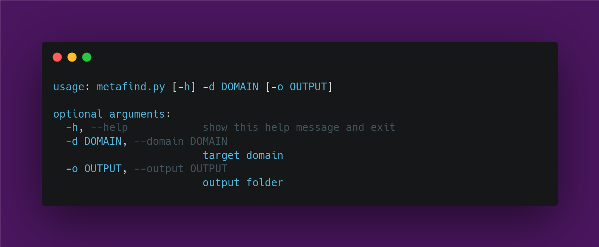
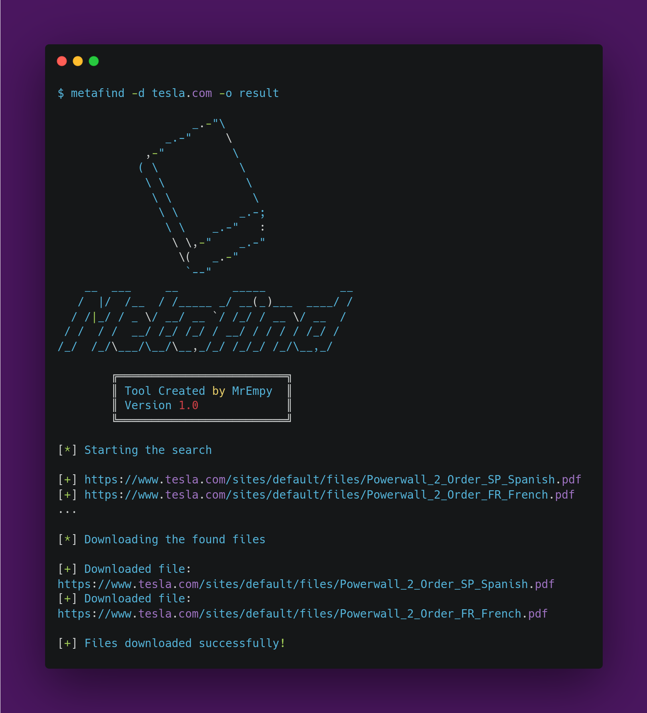

<h1 align="center">「📖」About Metafind</h1>


<p align="center">Metafind is an OSINT tool created with the aim of automating the search for metadata of a particular domain from the search engine known as Google.<p>
  
## Benefits:

* Search for multiple extensions
* Search files in target subdomains
* Save the result to a text file
* Download all found files and save in a folder
  
## Tested Operating Systems:

- [x] Linux
- [ ] MacOS
- [ ] Windows
  
## Instalation:
  
```
$ git clone https://github.com/MrEmpy/Metafind.git
$ cd Metafind
$ chmod +x install.sh
$ sudo ./install.sh
```
  
## Help:
  

  
## Demonstration:
  

